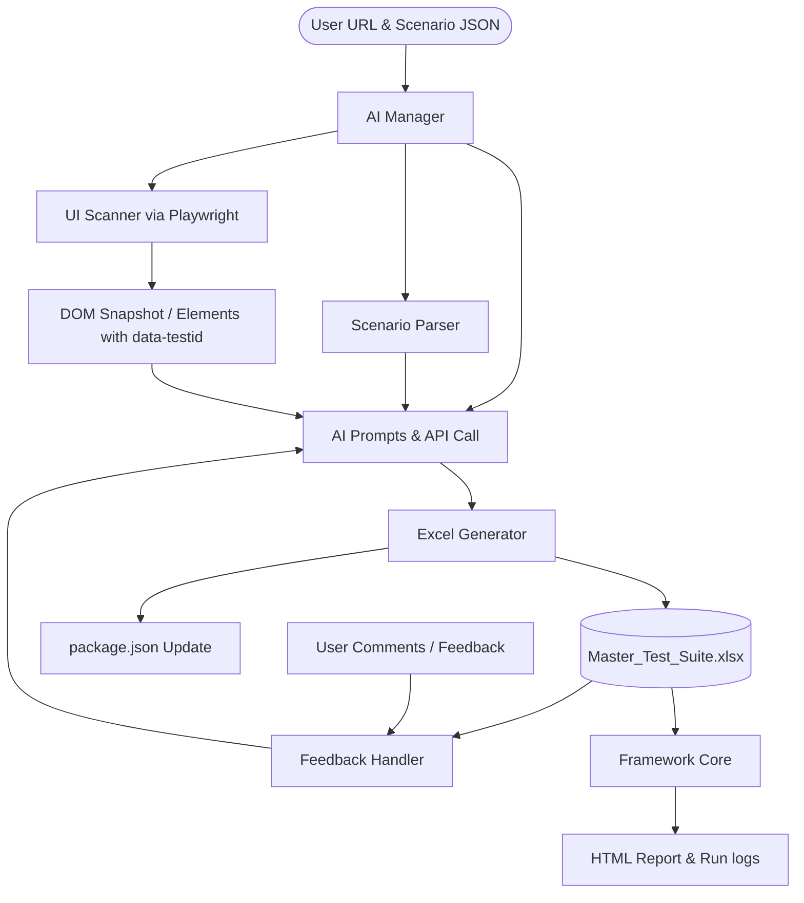

# Kế hoạch Triển khai — Tầng Điều phối AI (AI Orchestration Layer)

Nội dung kế hoạch này mô tả việc nâng cấp công cụ GUI Testing Tool bằng cách thêm tầng điều phối AI (AI Orchestration Layer) trong thư mục `ai/`. Tầng này nhận đầu vào là link URL và kịch bản test dạng JSON, tự động quét giao diện website bằng Playwright, sử dụng AI để tự động tạo và điền các sheet Element, Test Case và Test Data vào tệp `Master_Test_Suite.xlsx`, sau đó tự động cập nhật câu lệnh chạy test vào `package.json`. Tầng này cũng hỗ trợ nhận comment của người dùng để cập nhật lại dữ liệu Excel.



---

## Giải thích & Hướng dẫn về API Key

Để chạy các cuộc gọi AI trực tiếp từ mã nguồn Node.js/TypeScript trên máy local của bạn, mã nguồn cần một phương thức kết nối tới nhà cung cấp mô hình AI (như Gemini hoặc Claude). Dưới đây là thông tin chi tiết:

### 1. Có bắt buộc phải có API Key không?
*   **Có**: Nếu bạn muốn công cụ tự động phân tích một cách thông minh, tự động khớp Element với DOM, sinh Test Data thực tế và hiểu các comment phản hồi (Feedback) bằng tiếng Việt của bạn.
*   **Không (Có chế độ Dự phòng - Mock Mode)**: Nếu hệ thống không tìm thấy API Key nào trong môi trường/file `.env`, hệ thống sẽ tự động chuyển sang **Mock / Heuristic Mode**. Ở chế độ này:
    *   Hệ thống không gọi AI bên ngoài (hoàn toàn offline).
    *   Hệ thống sử dụng các thuật toán so khớp từ khóa cơ bản (ví dụ: thấy chữ "nhấp" hoặc "click" thì tự map thành hành động `click`, thấy "nhập" thì map thành `input`).
    *   Sinh ra dữ liệu giả lập dựa theo các template có sẵn.
    *   *Lưu ý*: Độ chính xác và thông minh của chế độ này sẽ bị giới hạn so với việc dùng AI thật.

---

### 2. Hướng dẫn từng bước lấy API Key miễn phí (Google Gemini)

Google cung cấp gói **Free Tier (Miễn phí)** rất phù hợp cho phát triển và kiểm thử cá nhân thông qua Google AI Studio:

*   **Bước 1**: Truy cập vào trang web [Google AI Studio](https://aistudio.google.com/).
*   **Bước 2**: Đăng nhập bằng tài khoản Google cá nhân của bạn.
*   **Bước 3**: Nhấp vào nút **"Get API key"** (ở góc trên bên trái).
*   **Bước 4**: Chọn **"Create API key"** -> Tạo khóa mới trong một dự án Google Cloud mới hoặc có sẵn.
*   **Bước 5**: Sao chép (Copy) đoạn mã khóa API vừa tạo (đoạn mã bắt đầu bằng `AIzaSy...`).
*   **Bước 6**: Tạo một file tên là `.env` ở thư mục gốc của dự án `gui-testing-tool/` và dán dòng sau vào:
    ```env
    GEMINI_API_KEY=mã_key_bạn_vừa_copy
    ```

*(Tương tự, nếu sau này bạn muốn đổi sang Claude của Anthropic, bạn có thể lấy key tại [Anthropic Console](https://console.anthropic.com/) và cấu hình `ANTHROPIC_API_KEY=...` vào file `.env`)*

---

## Các điểm đã thống nhất & Cập nhật từ phản hồi của bạn

> [!IMPORTANT]
> **1. Hỗ trợ Đa LLM (Gemini, Claude, OpenAI)**:
> Client giao tiếp AI (`ai/llm.client.ts`) sẽ kiểm tra các biến trong file `.env`:
> - Nếu có `GEMINI_API_KEY`, nó sẽ dùng API Gemini (mặc định model `gemini-2.5-flash` hoặc `gemini-1.5-flash` để tối ưu chi phí và tốc độ).
> - Nếu có `ANTHROPIC_API_KEY`, nó sẽ dùng API Claude.
> - Nếu không có key nào, nó cảnh báo và kích hoạt **Offline Mock Mode**.
> 
> **2. Tên Phân hệ (Module)**:
> Phân hệ sẽ nhận diện qua tham số truyền vào (ví dụ: `--module=QLHV`). Nếu không truyền, hệ thống sẽ tự động phân tích kịch bản JSON (ví dụ trong `reviewed-tc-batch-3.json` có liên quan đến `TraineeManagement / Quản lý Học viên` để sinh tên module là `QLHV`).
> 
> **3. Chế độ quét giao diện (Playwright UI Scanning)**:
> Mặc định chạy ở chế độ ẩn danh (headless). Cho phép cấu hình hiển thị trình duyệt bằng cách truyền flag `--headful` khi chạy lệnh.

---

## Chi tiết Thiết kế 4 Prompts dành cho AI

Dưới đây là chi tiết thiết kế của các prompt template mà chúng tôi sẽ cài đặt trong thư mục `ai/prompt/`:

### 🔹 Prompt 1 – ELEMENT DETECTION (`ai/prompt/element.prompt.ts`)
*   **Mục tiêu**: Phân tích danh sách các bước kịch bản (Scenario Steps) cùng với cấu trúc DOM đã được rút gọn của trang web để xác định các element cần thiết cho kịch bản và ánh xạ locator của chúng theo độ ưu tiên thiết lập.
*   **Quy định về độ ưu tiên bắt Element (Locator Priority)**:
    1.  **Ưu tiên 1 (`data-testid`)**: Nếu phần tử chứa thuộc tính `data-testid` hoặc `data-test-id`. Khi đó:
        *   `locator_type` = `data-testid`
        *   `locator_value` = giá trị thô của thuộc tính (ví dụ: `training-trainees-add-button`, không ghi dạng selector `[data-testid="..."]`).
    2.  **Ưu tiên 2 (`id`)**: Nếu có ID duy nhất trên trang.
        *   `locator_type` = `id`
        *   `locator_value` = giá trị id (ví dụ: `trainee_code`).
    3.  **Ưu tiên 3 (`name`)**: Đặc biệt hữu ích với các trường nhập liệu (`input`, `textarea`).
        *   `locator_type` = `name`
        *   `locator_value` = giá trị của thuộc tính name (ví dụ: `trainee_email`).
    4.  **Ưu tiên 4 (`xpath`)**: Dành cho các phần tử phức tạp không có data-testid/id/name hoặc định vị tương đối dựa vào nhãn (label).
        *   `locator_type` = `xpath`
        *   `locator_value` = câu XPath định vị chính xác và ổn định (ví dụ: `//div[label[contains(., 'Giới tính')]]//button` hoặc `//button[text()='Lưu Học viên']`).
    5.  **Ưu tiên 5 (`css`)**: Dành cho các phần tử định vị nhanh qua class/tag.
        *   `locator_type` = `css`
        *   `locator_value` = bộ chọn CSS selector (ví dụ: `button.bg-primary`).
*   **Dữ liệu đầu vào (Input)**:
    *   Test Scenario JSON (tóm tắt các bước cần tương tác).
    *   DOM Snapshot (mảng các phần tử: tagName, data-testid, placeholder, text, id, class, name).
*   **Định dạng đầu ra mong muốn (Output)**: JSON chứa danh sách các elements khớp với cấu trúc sheet `ELEMENT`:
    ```json
    [
      {
        "element_id": "btn_trainee_add",
        "locator_type": "data-testid",
        "locator_value": "training-trainees-add-button"
      },
      {
        "element_id": "txt_trainee_name",
        "locator_type": "data-testid",
        "locator_value": "training-trainees-upsert-name-input"
      },
      {
        "element_id": "btn_trainee_save",
        "locator_type": "xpath",
        "locator_value": "//button[text()='Lưu Học viên']"
      }
    ]
    ```

### 🔹 Prompt 2 – TEST CASE GENERATION (`ai/prompt/testcase.prompt.ts`)
*   **Mục tiêu**: So khớp kịch bản kiểm thử (Test Scenario) và các phần tử UI vừa phát hiện ở Prompt 1 để sinh ra danh sách các bước test case theo đúng định dạng dòng lệnh của Framework.
*   **Dữ liệu đầu vào (Input)**:
    *   Test Scenario JSON.
    *   Danh sách Element đã map ở Prompt 1.
    *   Danh sách Action Keywords được hỗ trợ (`navigate`, `click`, `input`, `check_status`, `call_tc`, v.v.).
*   **Định dạng đầu ra mong muốn (Output)**: Mảng các dòng dữ liệu để ghi vào sheet `TEST_CASE_<MODULE>` (với các cột: `tc-id`, `summary`, `type`, `step`, `action`, `target`, `value`, `expected`):
    ```json
    [
      {
        "tc-id": "TC_QLHV_001",
        "summary": "Thêm học viên mới thành công",
        "type": "ds_ls_trainee_pos",
        "step": 1,
        "action": "call_tc",
        "target": "TC_LOGIN_001",
        "value": null,
        "expected": null
      },
      {
        "tc-id": null,
        "summary": null,
        "type": null,
        "step": 2,
        "action": "input",
        "target": "txt_trainee_name",
        "value": "$data_qlhv.trainee_name",
        "expected": null
      }
    ]
    ```

### 🔹 Prompt 3 – TEST DATA GENERATION (`ai/prompt/testdata.prompt.ts`)
*   **Mục tiêu**: Nhìn vào cấu trúc của các trường dữ liệu được gọi ở Prompt 2 (ví dụ: `$data_qlhv.trainee_name`) và nghiệp vụ hiển thị trên UI, tự động sinh dữ liệu giả lập (fake data) hợp lệ (cho cả trường hợp positive và negative) để điền vào sheet `DATA_<MODULE>`.
*   **Dữ liệu đầu vào (Input)**:
    *   Test Cases đã sinh ở Prompt 2 (để biết các cột biến cần có, ví dụ: `trainee_name`, `trainee_dob`).
    *   Test Scenario JSON (quy định loại dữ liệu mong muốn, ví dụ: bỏ trống trường Nghề).
    *   UI context (gợi ý định dạng dữ liệu, ví dụ: ngày sinh định dạng YYYY-MM-DD, email đuôi @vinmec.com).
*   **Định dạng đầu ra mong muốn (Output)**: JSON mô tả headers và các dòng dữ liệu để chèn vào sheet `DATA_<MODULE>`:
    ```json
    {
      "headers": ["test_case_type", "trainee_code", "trainee_name", "trainee_dob", "trainee_gender"],
      "rows": [
        ["ds_ls_trainee_pos", "NV-12345", "Nguyễn Văn A", "1995-05-15", "Nam"],
        ["ds_ls_trainee_neg", "NV-ERROR", "Lỗi Tên", "1990-01-01", "Nữ"]
      ]
    }
    ```

### 🔹 Prompt 4 – PACKAGE.JSON UPDATE (`ai/prompt/package.prompt.ts` hoặc logic xử lý)
*   **Mục tiêu**: Khi một sheet mới được tạo (ví dụ: `TEST_CASE_QLHV`), AI sẽ tự động đọc file `package.json` hiện tại, cập nhật câu lệnh chạy test tương ứng cho sheet đó mà không làm mất các câu lệnh cũ.
*   **Dữ liệu đầu vào (Input)**:
    *   Tên Module mới (ví dụ: `QLHV`).
    *   Nội dung file `package.json` hiện tại.
*   **Định dạng đầu ra mong muốn (Output)**: File `package.json` hoàn chỉnh có bổ sung script chạy test mới:
    ```json
    "scripts": {
      ...
      "test:qlhv": "ts-node framework/run.ts --sheet=TEST_CASE_QLHV"
    }
    ```

---

## Thay đổi cấu trúc mã nguồn dự án

```text
gui-testing-tool/
│
├── ai/                                   # AI ORCHESTRATION LAYER (NEW)
│   ├── ai.manager.ts                    # File entry điều phối luồng chạy
│   ├── ui.scanner.ts                    # Quét DOM bằng Playwright
│   ├── scenario.parser.ts               # Phân tích cú pháp scenario JSON
│   ├── excel.generator.ts               # Sinh sheet và lưu vào Excel + Cập nhật package.json
│   ├── feedback.handler.ts              # Xử lý phản hồi sửa Excel từ người dùng
│   ├── llm.client.ts                    # Client giao tiếp với Gemini/Claude/OpenAI qua API keys
│   │
│   └── prompt/                          # Quản lý Prompt templates
│       ├── element.prompt.ts            # Định nghĩa Prompt 1
│       ├── testcase.prompt.ts           # Định nghĩa Prompt 2
│       ├── testdata.prompt.ts           # Định nghĩa Prompt 3
│       └── package.prompt.ts            # Định nghĩa Prompt 4
```

---

## Kế hoạch Xác minh (Verification Plan)

### Kiểm thử Tự động (Automated Verification)
Chạy lệnh điều phối AI trên terminal để sinh dữ liệu cho module `QLHV`:
```bash
npx ts-node ai/ai.manager.ts --url="https://sit-smh.vinmec.com/login" --scenario="reviewed-tc-batch-3.json" --module="QLHV"
```
Kiểm tra xem:
1. `Master_Test_Suite.xlsx` có thêm 3 sheet `ELEMENT_QLHV`, `TEST_CASE_QLHV`, `DATA_QLHV` với màu tiêu đề `1A3A4A` và freeze dòng 1.
2. File `package.json` có xuất hiện script `"test:qlhv": "ts-node framework/run.ts --sheet=TEST_CASE_QLHV"`.

### Kiểm thử Thủ công (Manual Verification)
1. Thử chạy script mới tạo:
   ```bash
   npm run test:qlhv
   ```
   Xem trình duyệt có khởi chạy và thực thi thành công không, báo cáo HTML có được lưu ở thư mục `reports/` không.
2. Thử cập nhật bằng comment phản hồi:
   ```bash
   npx ts-node ai/ai.manager.ts --module="QLHV" --feedback="Cập nhật lại tên mentor trong sheet DATA_QLHV thành 'Trần Thị Bích'"
   ```
   Kiểm tra sự thay đổi trong file Excel.
