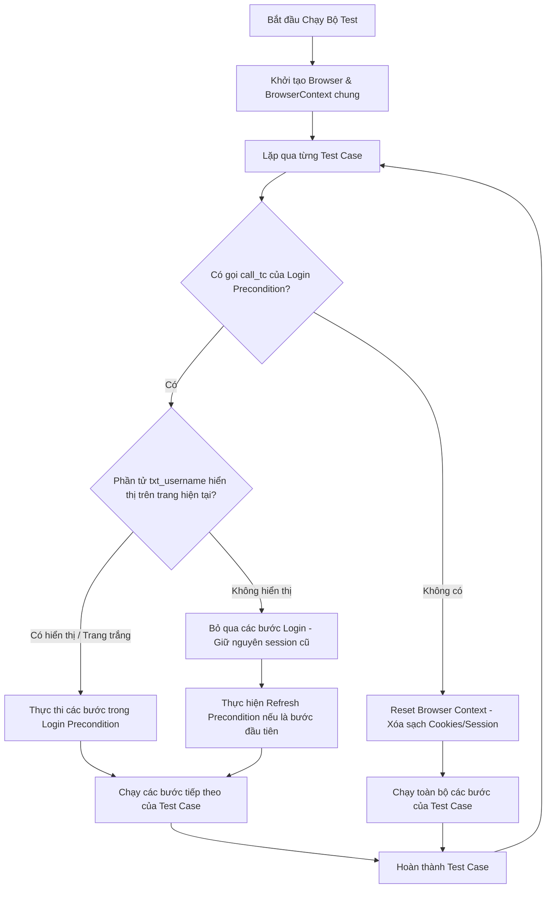

# Kế hoạch Triển khai - Tối ưu hóa Precondition & Định cấu trúc Test Case

Tài liệu này phác thảo kế hoạch nâng cấp trình chạy framework kiểm thử tự động, đảm bảo độc lập dữ liệu giữa các kịch bản độc lập/âm tính (Negative Testing), tối ưu hóa tái sử dụng session đăng nhập (Precondition), và cấu trúc lại các kịch bản kiểm thử có đúng 1 bước kiểm tra trạng thái (`check_status`) ở cuối cùng.

---

## 1. Thiết kế Luồng Xử lý Session & Precondition

Để giải quyết vấn đề kẹt session khi chạy các test case âm tính (như `TC_LOGIN_002` cần màn hình đăng nhập sạch) và hỗ trợ nhiều bộ dữ liệu kiểm thử khác nhau, chúng tôi đề xuất luồng điều phối trình duyệt như sau:

### Chi tiết giải pháp:

1. **Cách ly Session tự động (Session Isolation)**:
   - Các kịch bản kiểm thử không sử dụng Precondition (như kịch bản Đăng nhập `TC_LOGIN_001`, `TC_LOGIN_002`) sẽ tự động được chạy trong một **Browser Context sạch** (xóa sạch cookies, local storage). Điều này đảm bảo `TC_LOGIN_002` luôn đối mặt với giao diện đăng nhập trống để kiểm thử nhập sai thông tin.
   - Các kịch bản nghiệp vụ sau đó (như `TC_VAC_001`, `TC_VAC_002`) sử dụng `call_tc` gọi `TC_LOGIN_001` sẽ sử dụng chung Browser Context để chia sẻ session đăng nhập.

2. **Kiểm tra trạng thái Session động**:
   - Khi một kịch bản gọi `call_tc` đến `TC_LOGIN_001`:
     - Trình chạy test sẽ kiểm tra sự hiện diện của phần tử nhập username (`txt_username`) trong DOM hiện tại.
     - Nếu `txt_username` hiển thị (hoặc URL là trang trắng): Tiến hành chạy các bước đăng nhập.
     - Nếu `txt_username` không hiển thị (nghĩa là đã đăng nhập thành công từ trước): Bỏ qua toàn bộ các bước đăng nhập và sử dụng tiếp session hiện tại.
     - Nếu session bị hết hạn (expired) giữa chừng dẫn đến việc trang tự động redirect về màn hình login -> phần tử `txt_username` hiển thị -> hệ thống tự động đăng nhập lại.

3. **Hỗ trợ chạy nhiều vòng lặp dữ liệu (Data-Driven)**:
   - Hỗ trợ đầy đủ việc chạy lặp lại các kịch bản kiểm thử như `TC_LOGIN_002` với nhiều hàng dữ liệu khác nhau (Iter 1, Iter 2, Iter 3) từ sheet `DATA_LOGIN`. Mỗi vòng lặp sẽ tự động reset context để chạy độc lập.

---

## Chi tiết các tệp sẽ chỉnh sửa

### [MODIFY] [core.runner.ts](file:///c:/Users/datbt20/Documents/projects/gui-testing-tool/framework/core/engine/core.runner.ts)
* Di chuyển phần khởi tạo trình duyệt ra ngoài vòng lặp chính của các test case.
* Triển khai hàm reset context trong `BrowserManager` để xóa cookies/storage trước mỗi test case độc lập hoặc trước mỗi vòng lặp (iteration) của test case độc lập.
* Trong hàm `executeSteps`, thêm logic bỏ qua bước đăng nhập của precondition nếu session còn hoạt động.

### [MODIFY] [excel.validator.ts](file:///c:/Users/datbt20/Documents/projects/gui-testing-tool/framework/core/engine/excel/excel.validator.ts)
* Đăng ký hành động `Refresh Precondition` vào danh sách `VALID_ACTIONS`.

### [MODIFY] [action.dispatcher.ts](file:///c:/Users/datbt20/Documents/projects/gui-testing-tool/framework/actions/action.dispatcher.ts)
* Triển khai hành động `Refresh Precondition` thực hiện `await page.reload()`.

### [MODIFY] [update_excel.js](file:///c:/Users/datbt20/Documents/projects/gui-testing-tool/update_excel.js)
* Cấu trúc lại các dòng Test Case trong `TEST_CASE` sheet của cả 2 file Excel:
  - Cập nhật các test case để chỉ có duy nhất **1 bước `check_status` ở cuối**.
  - Bước đầu tiên của các kịch bản gọi lại Precondition sẽ là `Refresh Precondition`.

---

## Kế hoạch Xác minh

### Chạy kiểm thử tự động
1. Chạy cập nhật dữ liệu Excel: `node update_excel.js`
2. Chạy kịch bản kiểm thử: `npm run test`
3. Xác minh trong báo cáo/nhật ký:
   - `TC_LOGIN_002` chạy sạch (luôn hiển thị trang đăng nhập trống giữa các lần lặp).
   - Các kịch bản nghiệp vụ như `TC_VAC_001` bỏ qua bước đăng nhập khi session đã có sẵn.
   - Mỗi kịch bản nghiệp vụ khi bắt đầu sẽ thực hiện `Refresh Precondition`.
   - Mỗi test case hoàn thành và chỉ kiểm tra `check_status` 1 lần duy nhất ở bước cuối.
