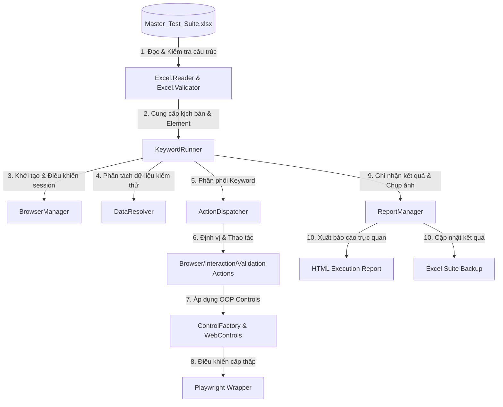

# HƯỚNG DẪN KIẾN TRÚC & VẬN HÀNH FRAMEWORK (AUTOMATION QA REVIEW)

Tài liệu này tổng hợp cấu trúc thư mục, luồng vận hành và triết lý thiết kế của **Keyword & Data-Driven Testing Framework**. Hệ thống được thiết kế hướng cấu hình 100%, tách biệt hoàn toàn giữa **Mã nguồn (Engine)** và **Kịch bản/Dữ liệu (Excel)**, giúp framework không cần thay đổi code khi chuyển giao sang các dự án khác.

---

## 1. Sơ đồ Luồng Vận hành (Execution Workflow)



---

## 2. Cấu trúc Thư mục (Project Folder Structure)

Cấu trúc dự án được phân chia chặt chẽ để cô lập phần mã nguồn khung chạy (Engine) khỏi kịch bản và dữ liệu nghiệp vụ:

```text
gui-testing-tool/
│
├── framework/                         # THƯ VIỆN CHUẨN (STANDARD LIBRARY - KHÔNG THAY ĐỔI)
│   ├── run.ts                         # Entry Point khởi chạy toàn bộ framework (đọc Excel, chạy test, sinh báo cáo)
│   │
│   ├── core/                          # TRÁI TIM CỦA FRAMEWORK (CORE LAYER)
│   │   ├── engine/                    # Trình điều khiển chính (Browser, Execution, Excel & Report)
│   │   │   ├── browser.manager.ts     # Quản lý vòng đời trình duyệt (Browser, Context, Page), tự động bật Headless
│   │   │   ├── core.runner.ts         # Trình thông dịch kịch bản Excel, điều phối hành động, giải quyết dữ liệu động
│   │   │   ├── excel/                 # Các tiện ích excel.reader.ts (đọc dữ liệu) & excel.validator.ts (kiểm tra lỗi cấu trúc)
│   │   │   └── report/                # report.manager.ts (tự động tạo báo cáo HTML, chụp screenshot và ghi kết quả)
│   │   │
│   │   ├── drivers/                   # playwright.wrapper.ts (Bọc lại API Playwright để xử lý ngoại lệ, đợi động)
│   │   └── utils/                     # data.resolver.ts (đọc biến động), update_excel_template.py (định dạng Excel)
│   │
│   ├── config/                        # Cấu hình hệ thống (framework.config.ts - Timeout, Viewport, Paths)
│   │
│   ├── actions/                       # THƯ VIỆN HÀNH ĐỘNG (KEYWORD LIBRARY)
│   │   ├── action.dispatcher.ts       # Router điều phối hành động ('click', 'input', 'check_status', 'refresh'...)
│   │   ├── browser.action.ts          # Thao tác trình duyệt (navigate, refresh, switch_tab)
│   │   ├── interaction.action.ts      # Thao tác chuột/phím vật lý (click, input, hover, select)
│   │   └── validation.action.ts       # Thao tác xác thực kết quả (verify_visible, verify_text)
│   │
│   └── controls/                      # THƯ VIỆN PHẦN TỬ UI (UI CONTROLS LAYER - UI ELEMENTS PATTERN)
│       ├── control.factory.ts         # Nhận diện loại phần tử qua Tiền tố (Prefix) của Target Element
│       ├── base.control.ts            # Lớp Control cơ sở chứa hành vi chung (click, verify_status, hover)
│       ├── input.control.ts           # Đối tượng TextBoxControl xử lý nhập liệu (tiền tố: txt_, inp_)
│       ├── dropdown.control.ts        # Đối tượng DropdownControl xử lý hộp chọn (tiền tố: ddl_, select_)
│       └── checkbox.control.ts        # Đối tượng CheckboxControl xử lý checkbox/radio (tiền tố: chk_, cb_)
│
├── test-data/                         # THƯ MỤC CẤU HÌNH NGHIỆP VỤ (CHỈ THAY ĐỔI KHI THAY ĐỔI DỰ ÁN)
│   └── Master_Test_Suite.xlsx         # File chứa kịch bản, phần tử định vị, trang và dữ liệu kiểm thử
│
├── reports/                           # LỊCH SỬ CHẠY THỬ & BẰNG CHỨNG (TỰ ĐỘNG SINH)
│   └── run_YYYY-MM-DDTHH-MM-SS/       # Thư mục riêng của từng lượt chạy kiểm thử
│       ├── Execution_Report.html      # Báo cáo HTML trực quan và tự động mở sau khi chạy
│       ├── Master_Test_Suite_Backup.xlsx # File Excel kết quả kiểm thử dự phòng
│       └── screenshots/               # Ảnh chụp bằng chứng (evidence) kiểm thử
│
├── mock-server/                       # GIAO DIỆN GIẢ LẬP ĐỂ TEST FRAMEWORK
│   ├── server.js                      # Web server Express phục vụ SPA Routing
│   └── views/                         # Trang web giả lập (vaccination.html, home.html) tích hợp các phần tử test
│
├── package.json                       # Scripts NPM và các thư viện phụ thuộc (Playwright, xlsx-populate, ts-node)
└── tsconfig.json                      # Cấu hình biên dịch TypeScript
```

---

## 3. Triết lý Thiết kế: "Code Không Đổi Khi Đổi Dự án"

Framework đạt được sự độc lập tuyệt đối nhờ vào 3 nguyên tắc cốt lõi:

### 1️⃣ Định nghĩa Phần tử độc lập (Repository on Excel)
Mọi Element/Selector của ứng dụng kiểm thử đều nằm trong sheet `ELEMENTS` của tệp Excel dưới dạng:
*   `txt_username` ➡️ `css=input[type="email"]`
*   `btn_login` ➡️ `xpath=//button[@type="submit"]`

Khi chuyển sang dự án mới, kiểm thử viên chỉ cần khai báo lại danh sách Element trong Excel mà không cần chỉnh sửa bất kỳ dòng mã nguồn TypeScript nào.

### 2️⃣ Kịch bản viết bằng ngôn ngữ tự nhiên (Keyword-Driven)
Kịch bản test nằm hoàn toàn trong sheet `TEST_CASE` sử dụng các từ khóa chuẩn hóa:
*   `navigate`: Điều hướng URL
*   `input`: Nhập dữ liệu
*   `click`: Nhấp chuột
*   `check_status`: Kiểm tra trạng thái hiển thị (Assert)

### 3️⃣ Tách biệt hoàn toàn Dữ liệu (Data-Driven)
Dữ liệu kiểm thử được tổ chức ở sheet riêng biệt (`TEST_DATA`) theo từng `Dataset`. Khi cần chạy nhiều tài khoản khác nhau hoặc test các luồng dữ liệu lỗi, chỉ cần thêm dòng dữ liệu mới trong Excel, framework tự động lặp lại (Data-driven iteration) cho kiểm thử viên.

---

## 4. Hướng dẫn Sử dụng & Vận hành (Workflow)

### 4.1. Quy trình Phát triển Test Case Mới (Zero-Code Workflow)
Dành cho QA, quy trình tạo và kiểm thử kịch bản mới hoàn toàn không cần can thiệp vào mã nguồn:

1. **Mở File Cấu Hình**: Mở tệp [Master_Test_Suite.xlsx](file:///c:/Users/datbt20/Documents/projects/gui-testing-tool/test-data/Master_Test_Suite.xlsx) bằng Microsoft Excel hoặc công cụ tương thích.
2. **Khai Báo Phần Tử UI (Sheet `ELEMENTS`)**:
   - Thêm các định vị (Locators) mới nếu cần.
   - Đặt tên theo chuẩn tiền tố để Framework tự động nhận diện Control:
     - `txt_` hoặc `inp_` cho Textbox (`InputControl`).
     - `ddl_` hoặc `select_` cho Dropdown (`DropdownControl`).
     - `chk_` hoặc `cb_` cho Checkbox/Radio (`CheckboxControl`).
     - `btn_` hoặc `lnk_` cho Button/Link (`BaseControl`).
3. **Chuẩn Bị Dữ Liệu (Sheet `TEST_DATA`)**:
   - Tạo bộ Test Data (Dataset) mới hoặc chỉnh sửa dữ liệu có sẵn.
   - Mỗi dòng dữ liệu tương ứng với một lần chạy (Iteration) cho Test Case cấu hình Dataset đó.
4. **Thiết Kế Kịch Bản (Sheet `TEST_CASE`)**:
   - Viết kịch bản các bước sử dụng các keyword chuẩn: `navigate`, `input`, `click`, `check_status`, `call_tc`.
   - Sử dụng định dạng `${column_name}` để truyền dữ liệu động từ sheet `TEST_DATA` vào các bước test.

---

### 4.2. Hướng dẫn Chạy Kiểm Thử (CLI Commands)

Hệ thống cung cấp các lệnh NPM tiện dụng để chạy toàn bộ hoặc từng phần kịch bản:

* **Chạy Toàn Bộ Test Suite**:
  ```bash
  npm run test
  ```
  *(Tương đương `npm run test:all`, sẽ chạy toàn bộ các test case có cột `Run` được tích `Y` trong file Excel).*

* **Chạy Theo Từng Phân Hệ/Sheet Cụ Thể**:
  ```bash
  npm run test:login    # Chỉ chạy các test case thuộc sheet TEST_CASE_LOGIN
  npm run test:vacxin   # Chỉ chạy các test case thuộc sheet TEST_CASE_VACXIN
  npm run test:lamsang  # Chỉ chạy các test case thuộc sheet TEST_CASE_LAMSANG
  ```

* **Chạy Bằng Bộ Lọc Custom**:
  ```bash
  npx ts-node framework/run.ts --sheet=TÊN_SHEET_CỦA_BẠN
  ```

> [!NOTE]
> **Cấu hình chế độ hiển thị UI (Headed vs Headless Mode):**
> * Mặc định Framework chạy ở chế độ **Headless (Ẩn danh/Không giao diện)** để tối ưu hóa hiệu năng và đảm bảo độ ổn định cao nhất khi chạy trên các máy chủ CI/CD hoặc môi trường Sandbox.
> * Nếu muốn xem trực tiếp thao tác của trình duyệt trên màn hình (Headed mode), hãy bật cờ môi trường trước khi chạy:
>   * **PowerShell (Windows)**: `$env:HEADLESS="false"; npm run test`
>   * **CMD (Windows)**: `set HEADLESS=false && npm run test`
>   * **Linux / macOS**: `HEADLESS=false npm run test`

---

### 4.3. Cơ Chế Xử Lý Session & Precondition Thông Minh

Để tối ưu hóa tốc độ và giảm thiểu sự trùng lặp trong viết kịch bản, Framework cung cấp cơ chế quản lý trạng thái trình duyệt tự động:

* **Liên Kết Kịch Bản Tiền Đề (`call_tc`)**:
  - QA sử dụng keyword `call_tc` với `TargetElement` là ID của Test Case tiền đề (ví dụ: `TC_LOGIN_001`) để chuẩn bị môi trường trước khi kiểm thử chức năng con.
* **Tối Ưu Hóa Tránh Trùng Lặp Session (Smart Skip)**:
  - Trước khi thực thi Test Case tiền đề, Framework sẽ tự động kiểm tra xem phần tử chính của trang tiền đề (như textbox đăng nhập) có còn hiển thị trên màn hình hay không.
  - Nếu **không hiển thị** (nghĩa là đã đăng nhập thành công và phiên làm việc còn hiệu lực), Framework sẽ **bỏ qua toàn bộ các bước đăng nhập** của kịch bản tiền đề, giúp tiết kiệm 70% thời gian thực thi.
* **Cô Lập Môi Trường Cho Test Case Độc Lập**:
  - Đối với các Test Case không có bước kịch bản tiền đề (`call_tc`), Framework tự động dọn dẹp cookies, bộ nhớ tạm (localStorage) và khởi tạo lại Context của trình duyệt mới để đảm bảo kiểm thử độc lập tuyệt đối, tránh ảnh hưởng chéo từ phiên chạy trước.

---

### 4.4. Đọc Kết Quả & Báo Cáo Kiểm Thử (Artifacts & Evidence)

Mỗi khi kết thúc lượt chạy, một thư mục kết quả riêng biệt theo mốc thời gian sẽ được sinh ra tự động trong thư mục `reports/run_YYYY-MM-DDTHH-MM-SS/`:

1. **HTML Execution Report (`Execution_Report.html`)**:
   - Trình duyệt sẽ tự động mở trang báo cáo trực quan này. Báo cáo cung cấp đầy đủ thông tin về tổng thời gian chạy, tỷ lệ Pass/Fail, chi tiết từng bước kiểm thử (Step Logs), và lý do lỗi cụ thể nếu có.
2. **Ảnh Chụp Bằng Chứng (Screenshots)**:
   - Chụp lại toàn bộ giao diện trang tại thời điểm kết thúc Test Case (kể cả khi Pass hoặc Fail) để làm bằng chứng kiểm thử (Evidence).
3. **File Excel Kết Quả Dự Phòng (`Master_Test_Suite_Backup.xlsx`)**:
   - Bản copy của file Excel gốc kèm theo cột trạng thái **Pass/Fail** và mô tả chi tiết kết quả được ghi nhận trực tiếp vào từng ô kịch bản.
