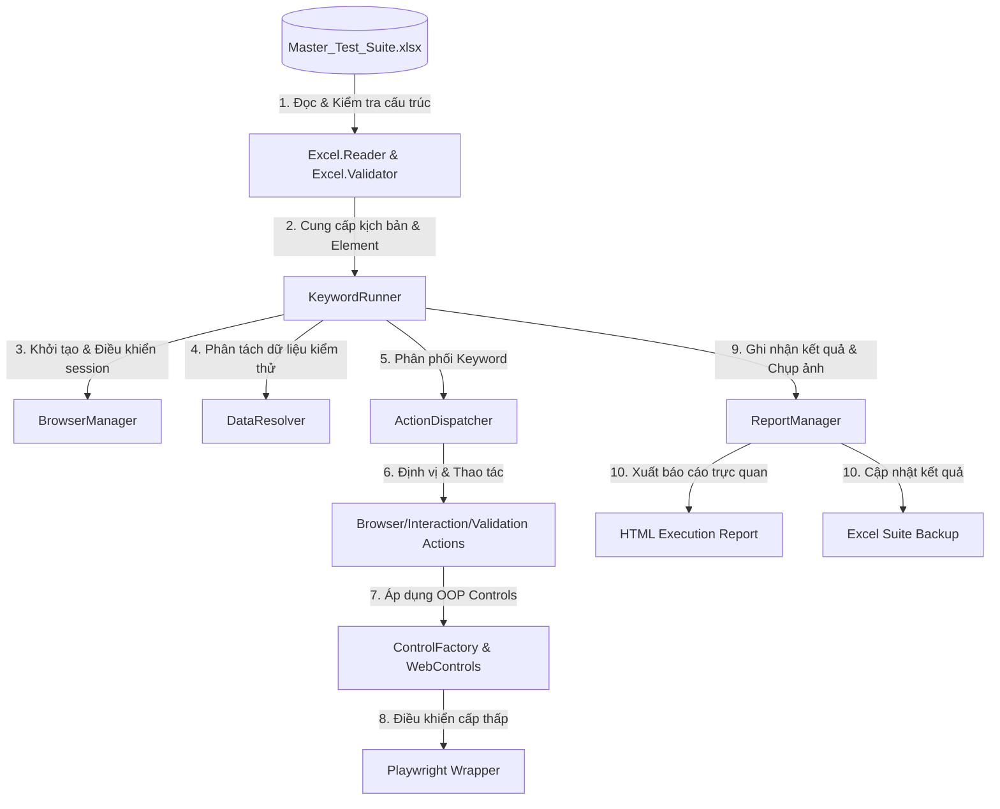

# HƯỚNG DẪN KIẾN TRÚC & VẬN HÀNH FRAMEWORK (AUTOMATION QA REVIEW)

Tài liệu này tổng hợp cấu trúc thư mục, luồng vận hành và triết lý thiết kế của **Keyword & Data-Driven Testing Framework**. Hệ thống được thiết kế hướng cấu hình 100%, tách biệt hoàn toàn giữa **Mã nguồn (Engine)** và **Kịch bản/Dữ liệu (Excel)**, giúp framework không cần thay đổi code khi chuyển giao sang các dự án khác.

---

## 1. Sơ đồ Luồng Vận hành (Execution Workflow)



---

## 2. Chi tiết Cấu trúc Thư mục (Project Folder Structure)

Thư mục `/framework` được phân chia lớp chặt chẽ theo mô hình hướng đối tượng (OOP) và kiến trúc sạch:

| Thư mục / File | Vai trò nghiệp vụ | Cơ chế hướng cấu hình (Không đổi code) |
| :--- | :--- | :--- |
| 📁 **`config/`** | Cấu hình tham số chạy toàn cục. | Định nghĩa timeouts, thư mục chứa báo cáo, và chế độ chạy ẩn danh (`HEADLESS`). |
| 📁 **`core/drivers/`** | Quản lý phiên và đối tượng trình duyệt. | `playwright.wrapper.ts` đóng gói trực tiếp Playwright Page để cung cấp driver thống nhất. |
| 📁 **`core/engine/`** | Bộ máy quét và thực thi kịch bản. | Chứa `browser.manager.ts` (quản lý vòng đời trình duyệt) và `core.runner.ts` (đọc kịch bản, chạy từng bước và tự động chụp ảnh màn hình). |
| 📁 **`core/engine/excel/`** | Phân tích cú pháp và xác thực Excel. | Đọc bảng tính Excel (`excel.reader.ts`) và tự động kiểm tra lỗi cấu trúc (`excel.validator.ts`) để từ chối chạy nếu kịch bản lỗi cấu trúc. |
| 📁 **`core/engine/report/`** | Trình tạo báo cáo tự động. | Tạo file báo cáo HTML trực quan và tự động cập nhật kết quả (PASS/FAIL) kèm lỗi chi tiết vào file Excel Backup mà không ảnh hưởng định dạng nguyên bản. |
| 📁 **`core/utils/`** | Các tiện ích xử lý dữ liệu. | `data.resolver.ts` phân tích các biến động trong ô dữ liệu (ví dụ: lấy giá trị từ cột chỉ định dựa theo bộ dữ liệu/dataset). |
| 📁 **`controls/`** | Bọc các thẻ HTML thành Đối tượng. | `base.control.ts`, `input.control.ts`, `dropdown.control.ts`... bọc các hành động tương ứng của nút bấm, ô nhập liệu, dropdown để tái sử dụng mã nguồn. |
| 📁 **`actions/`** | Bộ máy biên dịch Keyword thành hành động. | Đọc các Keyword từ Excel (`navigate`, `click`, `input`, `check_status`) và gọi hàm tương ứng. Lớp này hỗ trợ mở rộng thêm Keyword mới rất dễ dàng. |
| 📄 **`run.ts`** | Điểm khởi chạy (Entrypoint). | Đọc dữ liệu từ file Excel được cấu hình, chạy kiểm thử và tự động mở trình duyệt hiển thị báo cáo khi hoàn tất. |

---

## 3. Triết lý Thiết kế: "Code Không Đổi Khi Đổi Dự án"

Framework đạt được sự độc lập tuyệt đối nhờ vào 3 nguyên tắc cốt lõi:

### 1️⃣ Định nghĩa Phần tử độc lập (Repository on Excel)
Mọi Element/Selector của ứng dụng kiểm thử đều nằm trong sheet `ELEMENTS` của tệp Excel dưới dạng:
*   `txt_username` ➡️ `css=input[type="email"]`
*   `btn_login` ➡️ `xpath=//button[@type="submit"]`

Khi chuyển sang dự án mới, kiểm thử viên chỉ cần khai báo lại danh sách Element trong Excel mà không cần chỉnh sửa bất kỳ dòng mã nguồn TypeScript nào.

### 2️⃣ Kịch bản viết bằng ngôn ngữ tự nhiên (Keyword-Driven)
Kịch bản test nằm hoàn toàn trong sheet `TEST_CASE` sử dụng các từ khóa chuẩn hóa:
*   `navigate`: Điều hướng URL
*   `input`: Nhập dữ liệu
*   `click`: Nhấp chuột
*   `check_status`: Kiểm tra trạng thái hiển thị (Assert)

### 3️⃣ Tách biệt hoàn toàn Dữ liệu (Data-Driven)
Dữ liệu kiểm thử được tổ chức ở sheet riêng biệt (`TEST_DATA`) theo từng `Dataset`. Khi cần chạy nhiều tài khoản khác nhau hoặc test các luồng dữ liệu lỗi, chỉ cần thêm dòng dữ liệu mới trong Excel, framework tự động lặp lại (Data-driven iteration) cho kiểm thử viên.

---

## 4. Hướng dẫn Sử dụng & Vận hành (Workflow)

### Luồng làm việc của QA khi phát triển Test Case mới:
1.  **Bước 1**: Mở file Excel cấu hình `test-data/Master_Test_Suite.xlsx`.
2.  **Bước 2**: Khai báo các đối tượng UI mới (nếu có) trong sheet `ELEMENTS` (sử dụng XPath hoặc CSS selector).
3.  **Bước 3**: Nhập bộ dữ liệu cần kiểm thử vào sheet `TEST_DATA`.
4.  **Bước 4**: Viết kịch bản các bước trong sheet `TEST_CASE` sử dụng các Keyword có sẵn.
5.  **Bước 5**: Bật chạy kiểm thử tự động bằng lệnh:
    ```bash
    npm run test
    ```
6.  **Bước 6**: Xem kết quả chạy trực tiếp tại file báo cáo HTML tự động mở ra.

### Luồng xử lý Session thông minh (Precondition):
*   Framework hỗ trợ gọi test case tiền đề qua keyword `call_tc` (ví dụ: Gọi `TC_LOGIN_001` trước khi thực hiện các chức năng nghiệp vụ).
*   **Tối ưu hóa thời gian**: Framework tự động nhận diện nếu session đăng nhập vẫn hoạt động để **bỏ qua toàn bộ các bước đăng nhập** của precondition, giúp tăng tốc độ test lên gấp 3-4 lần.
