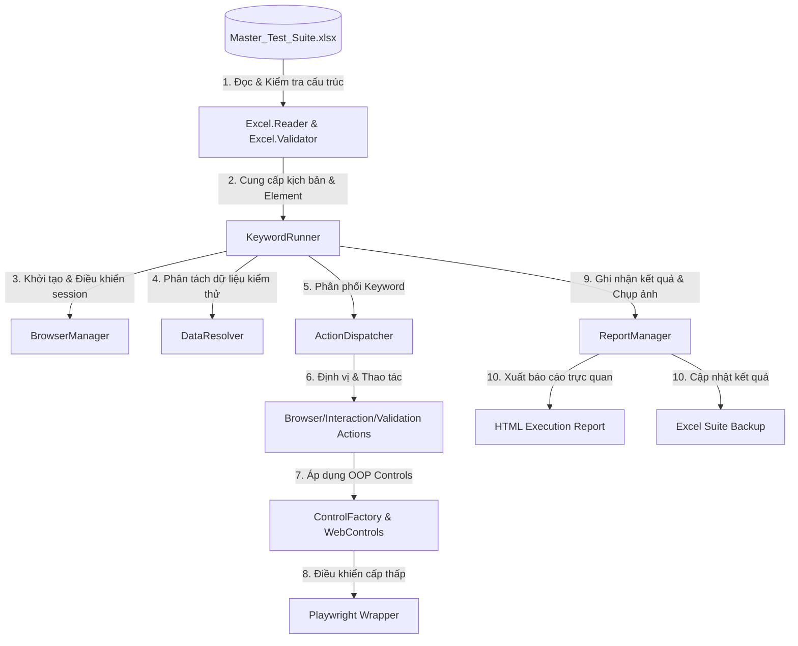

# HƯỚNG DẪN KIẾN TRÚC & VẬN HÀNH FRAMEWORK (AUTOMATION QA REVIEW)

Tài liệu này tổng hợp cấu trúc thư mục, luồng vận hành và triết lý thiết kế của **Keyword & Data-Driven Testing Framework**. Hệ thống được thiết kế hướng cấu hình 100%, tách biệt hoàn toàn giữa **Mã nguồn (Engine)** và **Kịch bản/Dữ liệu (Excel)**, giúp framework không cần thay đổi code khi chuyển giao sang các dự án khác.

---

## 1. Sơ đồ Luồng Vận hành (Execution Workflow)



---

## 2. Cấu trúc Thư mục (Project Folder Structure)

Cấu trúc dự án được phân chia chặt chẽ để cô lập phần mã nguồn khung chạy (Engine) khỏi kịch bản và dữ liệu nghiệp vụ:

```text
gui-testing-tool/
│
├── framework/                         # THƯ VIỆN CHUẨN (STANDARD LIBRARY - KHÔNG THAY ĐỔI)
│   ├── run.ts                         # Entry Point khởi chạy toàn bộ framework (đọc Excel, chạy test, sinh báo cáo)
│   │
│   ├── core/                          # TRÁI TIM CỦA FRAMEWORK (CORE LAYER)
│   │   ├── engine/                    # Trình điều khiển chính (Browser, Execution, Excel & Report)
│   │   │   ├── browser.manager.ts     # Quản lý vòng đời trình duyệt (Browser, Context, Page), tự động bật Headless
│   │   │   ├── core.runner.ts         # Trình thông dịch kịch bản Excel, điều phối hành động, giải quyết dữ liệu động
│   │   │   ├── excel/                 # Các tiện ích excel.reader.ts (đọc dữ liệu) & excel.validator.ts (kiểm tra lỗi cấu trúc)
│   │   │   └── report/                # report.manager.ts (tự động tạo báo cáo HTML, chụp screenshot và ghi kết quả)
│   │   │
│   │   ├── drivers/                   # playwright.wrapper.ts (Bọc lại API Playwright để xử lý ngoại lệ, đợi động)
│   │   └── utils/                     # data.resolver.ts (đọc biến động), update_excel_template.py (định dạng Excel)
│   │
│   ├── config/                        # Cấu hình hệ thống (framework.config.ts - Timeout, Viewport, Paths)
│   │
│   ├── actions/                       # THƯ VIỆN HÀNH ĐỘNG (KEYWORD LIBRARY)
│   │   ├── action.dispatcher.ts       # Router điều phối hành động ('click', 'input', 'check_status', 'refresh'...)
│   │   ├── browser.action.ts          # Thao tác trình duyệt (navigate, refresh, switch_tab)
│   │   ├── interaction.action.ts      # Thao tác chuột/phím vật lý (click, input, hover, select)
│   │   └── validation.action.ts       # Thao tác xác thực kết quả (verify_visible, verify_text)
│   │
│   └── controls/                      # THƯ VIỆN PHẦN TỬ UI (UI CONTROLS LAYER - UI ELEMENTS PATTERN)
│       ├── control.factory.ts         # Nhận diện loại phần tử qua Tiền tố (Prefix) của Target Element
│       ├── base.control.ts            # Lớp Control cơ sở chứa hành vi chung (click, verify_status, hover)
│       ├── input.control.ts           # Đối tượng TextBoxControl xử lý nhập liệu (tiền tố: txt_, inp_)
│       ├── dropdown.control.ts        # Đối tượng DropdownControl xử lý hộp chọn (tiền tố: ddl_, select_)
│       └── checkbox.control.ts        # Đối tượng CheckboxControl xử lý checkbox/radio (tiền tố: chk_, cb_)
│
├── test-data/                         # THƯ MỤC CẤU HÌNH NGHIỆP VỤ (CHỈ THAY ĐỔI KHI THAY ĐỔI DỰ ÁN)
│   └── Master_Test_Suite.xlsx         # File chứa kịch bản, phần tử định vị, trang và dữ liệu kiểm thử
│
├── reports/                           # LỊCH SỬ CHẠY THỬ & BẰNG CHỨNG (TỰ ĐỘNG SINH)
│   └── run_YYYY-MM-DDTHH-MM-SS/       # Thư mục riêng của từng lượt chạy kiểm thử
│       ├── Execution_Report.html      # Báo cáo HTML trực quan và tự động mở sau khi chạy
│       ├── Master_Test_Suite_Backup.xlsx # File Excel kết quả kiểm thử dự phòng
│       └── screenshots/               # Ảnh chụp bằng chứng (evidence) kiểm thử
│
├── mock-server/                       # GIAO DIỆN GIẢ LẬP ĐỂ TEST FRAMEWORK
│   ├── server.js                      # Web server Express phục vụ SPA Routing
│   └── views/                         # Trang web giả lập (vaccination.html, home.html) tích hợp các phần tử test
│
├── package.json                       # Scripts NPM và các thư viện phụ thuộc (Playwright, xlsx-populate, ts-node)
└── tsconfig.json                      # Cấu hình biên dịch TypeScript
```

---

## 3. Triết lý Thiết kế: "Code Không Đổi Khi Đổi Dự án"

Framework đạt được sự độc lập tuyệt đối nhờ vào 3 nguyên tắc cốt lõi:

### 1️⃣ Định nghĩa Phần tử độc lập (Repository on Excel)
Mọi Element/Selector của ứng dụng kiểm thử đều nằm trong sheet `ELEMENTS` của tệp Excel dưới dạng:
*   `txt_username` ➡️ `css=input[type="email"]`
*   `btn_login` ➡️ `xpath=//button[@type="submit"]`

Khi chuyển sang dự án mới, kiểm thử viên chỉ cần khai báo lại danh sách Element trong Excel mà không cần chỉnh sửa bất kỳ dòng mã nguồn TypeScript nào.

### 2️⃣ Kịch bản viết bằng ngôn ngữ tự nhiên (Keyword-Driven)
Kịch bản test nằm hoàn toàn trong sheet `TEST_CASE` sử dụng các từ khóa chuẩn hóa:
*   `navigate`: Điều hướng URL
*   `input`: Nhập dữ liệu
*   `click`: Nhấp chuột
*   `check_status`: Kiểm tra trạng thái hiển thị (Assert)

### 3️⃣ Tách biệt hoàn toàn Dữ liệu (Data-Driven)
Dữ liệu kiểm thử được tổ chức ở sheet riêng biệt (`TEST_DATA`) theo từng `Dataset`. Khi cần chạy nhiều tài khoản khác nhau hoặc test các luồng dữ liệu lỗi, chỉ cần thêm dòng dữ liệu mới trong Excel, framework tự động lặp lại (Data-driven iteration) cho kiểm thử viên.

---

## 4. Hướng dẫn Sử dụng & Vận hành (Workflow)

### Luồng làm việc của QA khi phát triển Test Case mới:
1.  **Bước 1**: Mở file Excel cấu hình `test-data/Master_Test_Suite.xlsx`.
2.  **Bước 2**: Khai báo các đối tượng UI mới (nếu có) trong sheet `ELEMENTS` (sử dụng XPath hoặc CSS selector).
3.  **Bước 3**: Nhập bộ dữ liệu cần kiểm thử vào sheet `TEST_DATA`.
4.  **Bước 4**: Viết kịch bản các bước trong sheet `TEST_CASE` sử dụng các Keyword có sẵn.
5.  **Bước 5**: Bật chạy kiểm thử tự động bằng lệnh:
    ```bash
    npm run test
    ```
6.  **Bước 6**: Xem kết quả chạy trực tiếp tại file báo cáo HTML tự động mở ra.

### Luồng xử lý Session thông minh (Precondition):
*   Framework hỗ trợ gọi test case tiền đề qua keyword `call_tc` (ví dụ: Gọi `TC_LOGIN_001` trước khi thực hiện các chức năng nghiệp vụ).
*   **Tối ưu hóa thời gian**: Framework tự động nhận diện nếu session đăng nhập vẫn hoạt động để **bỏ qua toàn bộ các bước đăng nhập** của precondition, giúp tăng tốc độ test lên gấp 3-4 lần.
