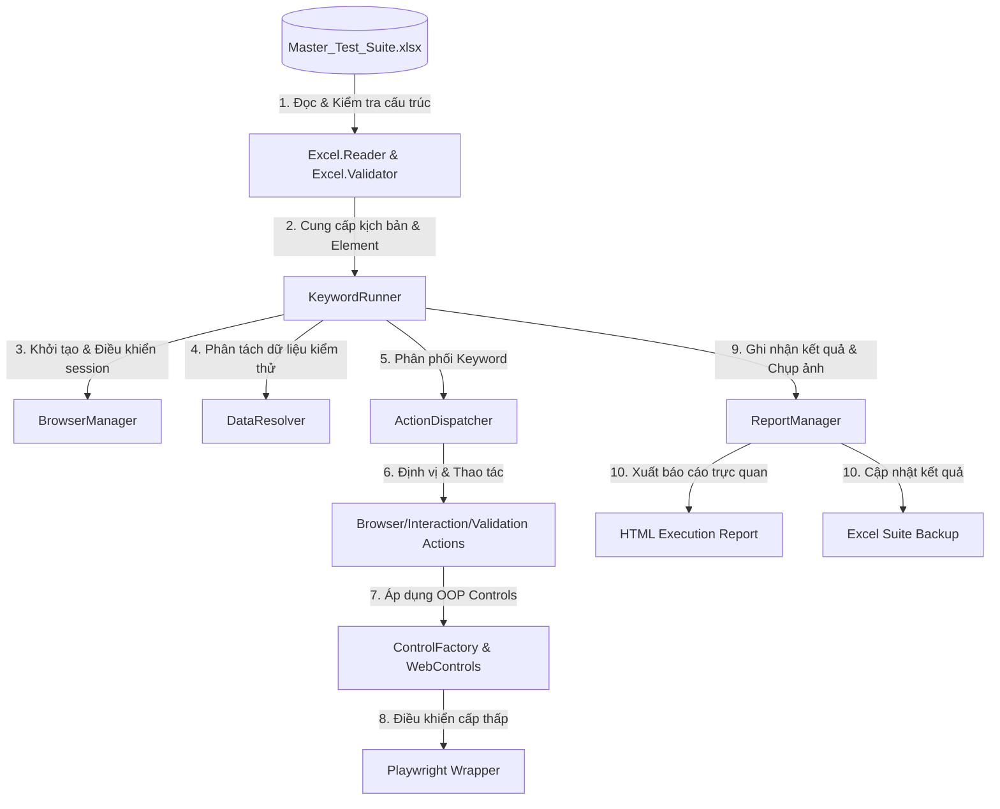

# HƯỚNG DẪN KIẾN TRÚC & VẬN HÀNH FRAMEWORK (AUTOMATION QA REVIEW)

Tài liệu này tổng hợp cấu trúc thư mục, luồng vận hành và triết lý thiết kế của **Keyword & Data-Driven Testing Framework**. Hệ thống được thiết kế hướng cấu hình 100%, tách biệt hoàn toàn giữa **Mã nguồn (Engine)** và **Kịch bản/Dữ liệu (Excel)**, giúp framework không cần thay đổi code khi chuyển giao sang các dự án khác.

---

## 1. Sơ đồ Luồng Vận hành (Execution Workflow)



---

## 2. Cấu trúc Thư mục (Project Folder Structure)

Dưới đây là sơ đồ cấu trúc của dự án được sắp xếp hợp lý và giải thích ngắn gọn vai trò của từng thành phần:

```text
gui-testing-tool/
├── framework/                       # LÕI FRAMEWORK (ENGINE) - KHÔNG THAY ĐỔI KHI ĐỔI DỰ ÁN
│   ├── run.ts                       # Entry Point khởi chạy kiểm thử & xuất báo cáo
│   │
│   ├── core/                        # CÁC LỚP XỬ LÝ LÕI TRUNG TÂM
│   │   ├── engine/                  # Bộ điều khiển chính (Browser, Runner, Excel & Báo cáo)
│   │   │   ├── browser.manager.ts   # Quản lý vòng đời trình duyệt (Browser, Context, Page)
│   │   │   ├── core.runner.ts       # Thông dịch kịch bản từ Excel & điều phối các bước test
│   │   │   ├── excel/               # Đọc và xác thực cấu trúc dữ liệu tệp Excel
│   │   │   └── report/              # Tạo báo cáo HTML & xuất Excel kết quả chạy thử
│   │   │
│   │   ├── drivers/                 # Playwright Wrapper - xử lý tương tác cấp thấp, đợi động
│   │   └── utils/                   # Các tiện ích bổ trợ (Đọc biến động, Đồng bộ cấu trúc Excel)
│   │
│   ├── config/                      # Cấu hình hệ thống (Timeout, Viewport, Đường dẫn)
│   ├── actions/                     # Thư viện hành động chuẩn (click, input, verify, navigate...)
│   └── controls/                    # Đối tượng hóa UI Elements (Textbox, Checkbox, Dropdown)
│
├── test-data/                       # NƠI LƯU TRỮ KỊCH BẢN & DỮ LIỆU CHẠY TEST (EXCEL)
│   ├── Master_Test_Suite.xlsx       # Kịch bản kiểm thử chính (thay đổi khi đổi dự án)
│   └── Template_Master_Test_Suite.xlsx # Kịch bản mẫu dùng để đồng bộ/phục hồi
│
├── reports/                         # Lưu lịch sử báo cáo HTML & Screenshots (Tự sinh khi chạy xong)
├── package.json                     # Quản lý script khởi chạy & thư viện phụ thuộc
└── tsconfig.json                    # Cấu hình môi trường biên dịch TypeScript
```

---

## 3. Các bước cài đặt dự án (Setup Guide)

Thực hiện lần lượt 3 bước dưới đây để thiết lập môi trường sau khi clone mã nguồn dự án về máy:

### Bước 1: Cài đặt các thư viện phụ thuộc (Node Packages)

Mở CMD/PowerShell tại thư mục gốc của dự án và chạy:

```bash
npm install
```

### Bước 2: Cài đặt trình duyệt kiểm thử (Playwright Browsers)

Cài đặt các nhân trình duyệt cần thiết để Playwright thực thi:

```bash
npx playwright install
```

### Bước 3: Kiểm tra cài đặt bằng cách khởi chạy test mặc định

```bash
npm run test
```

---

## 4. Hướng dẫn sử dụng file Excel

Kịch bản và dữ liệu test được tổ chức khoa học trong [Master_Test_Suite.xlsx](file:///c:/Users/datbt20/Documents/projects/gui-testing-tool/test-data/Master_Test_Suite.xlsx) thông qua 3 nhóm sheet chính:

### 1️⃣ Các sheet cấu hình chung

* **`PAGE`**: Lưu trữ URL của hệ thống (ví dụ: `url_sit_login` ứng với `https://sit-smh.vinmec.com/login`). Tránh việc ghi đè cứng URL trong các bước kiểm thử.
* **`ACTION_LIST`**: Tra cứu danh sách các từ khóa hành động (Keywords) mà framework hỗ trợ (như `click`, `input`, `check_status`, `navigate`).

### 2️⃣ Bộ 3 sheet nghiệp vụ theo từng phân hệ (Module)

* **`TEST_CASE_<MODULE>`** (Ví dụ: `TEST_CASE_LOGIN`):
  * **`tc-id`**: Mã định danh duy nhất của Test Case (Ví dụ: `TC_LOGIN_001`).
  * **`summary`**: Tóm tắt mục đích kiểm thử.
  * **`step`**: Thứ tự thực hiện bước test.
  * **`action`**: Keyword hành động (lấy từ sheet `ACTION_LIST`).
  * **`target`**: Phần tử giao diện tương tác (tham chiếu từ sheet `ELEMENT`).
  * **`value`**: Giá trị đầu vào (có thể điền cứng hoặc truyền động qua cú pháp `$data_module.tên_cột`).
  * **`expected`**: Kết quả mong đợi dùng để xác thực (Assert).
* **`DATA_<MODULE>`** (Ví dụ: `DATA_LOGIN`):
  * Chứa các bộ dữ liệu test phục vụ cho luồng chạy Data-Driven.
  * Cột đầu tiên luôn là `test_case_type` (khớp với cột `type` ở sheet `TEST_CASE`) để framework tìm đúng dòng dữ liệu tương ứng.
* **`ELEMENT_<MODULE>`** (Ví dụ: `ELEMENT_LOGIN`):
  * Bản đồ định vị các phần tử giao diện (UI Repository).
  * **`element_id`**: Tên gợi nhớ của phần tử (Ví dụ: `txt_username`, `btn_login`).
  * **`locator_type`**: Loại định vị (`id`, `css`, `xpath`, `data-testid`).
  * **`locator_value`**: Giá trị định vị tương ứng trên trang.

### 3️⃣ Gọi Kịch bản Tiền đề (Precondition với `call_tc`)

Để tránh viết lặp lại các bước chuẩn bị (Ví dụ: Đăng nhập), sử dụng keyword `call_tc`:

* **Cách viết**: Điền `call_tc` vào cột `action`, và điền mã Test Case tiền đề (Ví dụ: `TC_LOGIN_001`) vào cột `target`.
* **Cơ chế Smart Session Skip**: Khi gọi `call_tc` đến trang đăng nhập, nếu trình duyệt đã đăng nhập sẵn từ trước, framework sẽ **tự động bỏ qua các bước đăng nhập** của kịch bản tiền đề để tối ưu thời gian chạy.

---

## 5. Hướng dẫn câu lệnh run test:

Sử dụng các câu lệnh NPM sau để khởi chạy kiểm thử linh hoạt:

### ⚡ Chạy tất cả kịch bản được kích hoạt

Chạy toàn bộ các test case có cột `Run` được đánh dấu `Y` trong file Excel:

```bash
npm run test
```

*(Hoặc sử dụng lệnh: `npm run test:all`)*

### 🎯 Chạy theo từng phân hệ (Sheet cụ thể)

Chạy độc lập kịch bản của một phân hệ mong muốn:

```bash
npm run test:login   # Chỉ chạy các test case trong sheet TEST_CASE_LOGIN
npm run test:vacxin  # Chỉ chạy các test case trong sheet TEST_CASE_VACXIN
npm run test:qlhv    # Chỉ chạy các test case trong sheet TEST_CASE_QLHV
```
