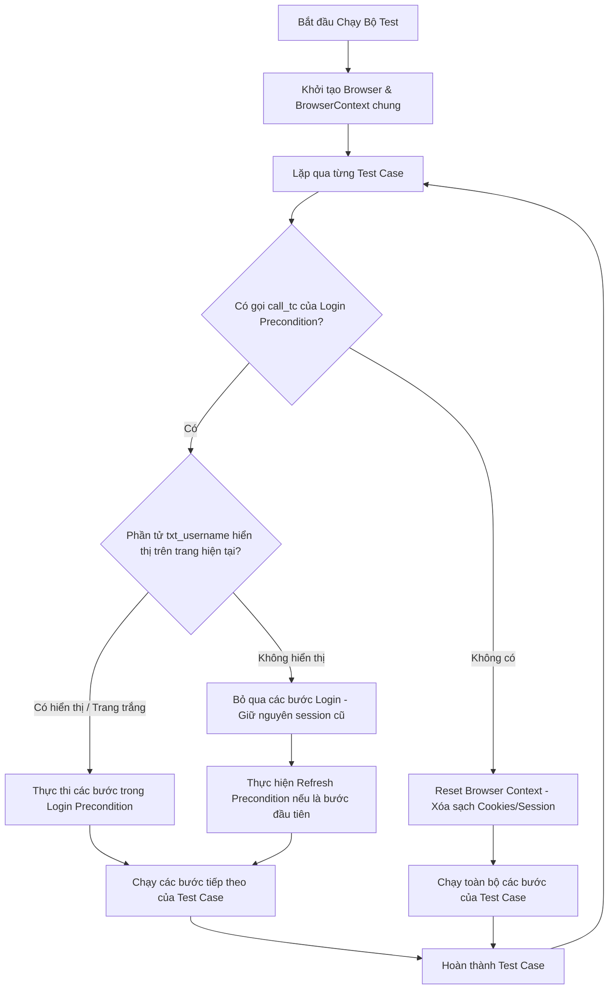

# Kế hoạch Triển khai - Tối ưu hóa Precondition & Thiết kế Framework Hướng Cấu hình (Senior QA Automation)

Tài liệu này phác thảo kế hoạch nâng cấp framework kiểm thử tự động theo tiêu chuẩn của một **Senior QA Automation Engineer**: Thiết kế hướng cấu hình (Data/Keyword-Driven), đảm bảo độc lập dữ liệu, tái sử dụng session thông minh (Precondition), tự động cách ly session cho các ca kiểm thử âm tính (Negative Testing), và phân nhóm kiểm thử (Smoke/Regression) bằng cấu hình Excel + Command Line.

---

## 1. Thiết kế Hệ thống & Luồng Xử lý Session

Để giải quyết vấn đề kẹt session khi chạy các test case âm tính (như `TC_LOGIN_002` cần màn hình đăng nhập sạch) và hỗ trợ nhiều bộ dữ liệu kiểm thử khác nhau, chúng tôi đề xuất luồng điều phối trình duyệt như sau:



### Chi tiết giải pháp kỹ thuật:

1. **Cách ly Session tự động (Session Isolation)**:
   - Các kịch bản kiểm thử không sử dụng Precondition (hoặc chính các kịch bản Đăng nhập như `TC_LOGIN_001`, `TC_LOGIN_002`) sẽ tự động được chạy trong một **Browser Context sạch** (xóa sạch cookies, local storage). Điều này đảm bảo `TC_LOGIN_002` luôn đối mặt với giao diện đăng nhập trống để kiểm thử nhập sai thông tin.
   - Các kịch bản nghiệp vụ sau đó (như `TC_VAC_001`, `TC_VAC_002`) sử dụng `call_tc` gọi `TC_LOGIN_001` sẽ sử dụng chung Browser Context để chia sẻ session đăng nhập.

2. **Kiểm tra trạng thái Session động (Zero Hardcode)**:
   - Khi một test case gọi `call_tc` đến `TC_LOGIN_001`:
     - Trình chạy test sẽ kiểm tra sự hiện diện của phần tử nhập username (`txt_username`) trong DOM hiện tại.
     - Nếu `txt_username` hiển thị (hoặc URL là trang trắng): Tiến hành đăng nhập.
     - Nếu `txt_username` không hiển thị (nghĩa là đã đăng nhập và đang ở màn hình trong): Bỏ qua toàn bộ các bước đăng nhập và sử dụng tiếp session hiện tại.
     - Nếu session bị hết hạn (expired) giữa chừng dẫn đến việc trang tự động redirect về màn hình login -> phần tử `txt_username` sẽ hiển thị lại -> hệ thống sẽ tự động thực hiện đăng nhập lại (retry).

3. **Hỗ trợ chạy nhiều vòng lặp dữ liệu (Data-Driven Testing)**:
   - Hỗ trợ đầy đủ việc chạy lặp lại các kịch bản kiểm thử như `TC_LOGIN_002` với nhiều hàng dữ liệu khác nhau (Iter 1, Iter 2, Iter 3) từ sheet `DATA_LOGIN`. Mỗi vòng lặp của kịch bản đăng nhập sẽ tự động reset context để chạy sạch.

---

## 2. Thiết kế Hướng Cấu hình (Phân nhóm Smoke & Regression)

Để framework hoàn toàn không phải sửa code khi đổi dự án hoặc khi muốn chuyển đổi giữa các nhóm kiểm thử khác nhau:

1. **Cấu hình trên Excel (sheet `TEST_CASE`)**:
   - Đọc cột **`Execute`** (ON/OFF) từ Excel để bật/tắt kịch bản động.
   - Thêm cột **`Category`** (nhóm kiểm thử) vào sheet `TEST_CASE`. Ví dụ:
     - `TC_LOGIN_001` -> `Smoke, Regression`
     - `TC_VAC_001` -> `Smoke`
     - `TC_VAC_002` -> `Regression`
   
2. **Cấu hình qua Command Line (Environment Variable)**:
   - Sử dụng biến môi trường `TEST_SUITE` (ví dụ: `TEST_SUITE=Smoke` hoặc `TEST_SUITE=Regression`).
   - Khi chạy test, hệ thống sẽ lọc: Chỉ thực thi những Test Case có cột `Execute` là `ON` **VÀ** có `Category` chứa giá trị của `TEST_SUITE`.
   - Nếu không truyền `TEST_SUITE`, hệ thống chạy tất cả các test case có `Execute` là `ON`.

---

## Chi tiết các tệp sẽ chỉnh sửa

### [MODIFY] [excel.reader.ts](file:///c:/Users/datbt20/Documents/projects/gui-testing-tool/framework/core/engine/excel/excel.reader.ts)
* Đọc thêm cột `Execute` (ánh xạ vào thuộc tính `run`) và cột `Category` (ánh xạ vào thuộc tính `category`) từ sheet `TEST_CASE`.

### [MODIFY] [core.runner.ts](file:///c:/Users/datbt20/Documents/projects/gui-testing-tool/framework/core/engine/core.runner.ts)
* Chuyển logic khởi động/đóng trình duyệt ra ngoài vòng lặp chính.
* Thêm hàm `resetContext()` trong `BrowserManager` để xóa sạch session khi chạy các test case độc lập.
* Kiểm tra thuộc tính `run` và lọc danh sách test case dựa trên biến môi trường `process.env.TEST_SUITE`.
* Thêm cơ chế kiểm tra `txt_username` trước khi chạy các bước của Precondition.

### [MODIFY] [excel.validator.ts](file:///c:/Users/datbt20/Documents/projects/gui-testing-tool/framework/core/engine/excel/excel.validator.ts)
* Đăng ký hành động `Refresh Precondition`.

### [MODIFY] [action.dispatcher.ts](file:///c:/Users/datbt20/Documents/projects/gui-testing-tool/framework/actions/action.dispatcher.ts)
* Triển khai hành động `Refresh Precondition` thực hiện `await page.reload()`.

### [MODIFY] [update_excel.js](file:///c:/Users/datbt20/Documents/projects/gui-testing-tool/update_excel.js)
* Cấu trúc lại các dòng Test Case trong `TEST_CASE` sheet của cả 2 file Excel:
  - Thêm cột `Category` cho từng test case.
  - Cập nhật các test case để chỉ có duy nhất **1 bước `check_status` ở cuối**.
  - Bước đầu tiên của các test case gọi lại Precondition sẽ là `Refresh Precondition`.

---

## Kế hoạch Xác minh

### Chạy kiểm thử tự động
1. Chạy cập nhật dữ liệu Excel: `node update_excel.js`
2. **Chạy toàn bộ Regression Test**:
   ```bash
   cross-env TEST_SUITE=Regression npm run test
   ```
3. **Chạy riêng Smoke Test**:
   ```bash
   cross-env TEST_SUITE=Smoke npm run test
   ```
4. Xác minh trong báo cáo/nhật ký:
   - Các kịch bản Đăng nhập và Nghiệp vụ được phân loại và chạy đúng theo bộ lọc.
   - `TC_LOGIN_002` chạy sạch (luôn hiển thị trang đăng nhập trống giữa các lần lặp).
   - Nghi nghiệp vụ `TC_VAC_001` bỏ qua bước đăng nhập khi session đã có sẵn.
